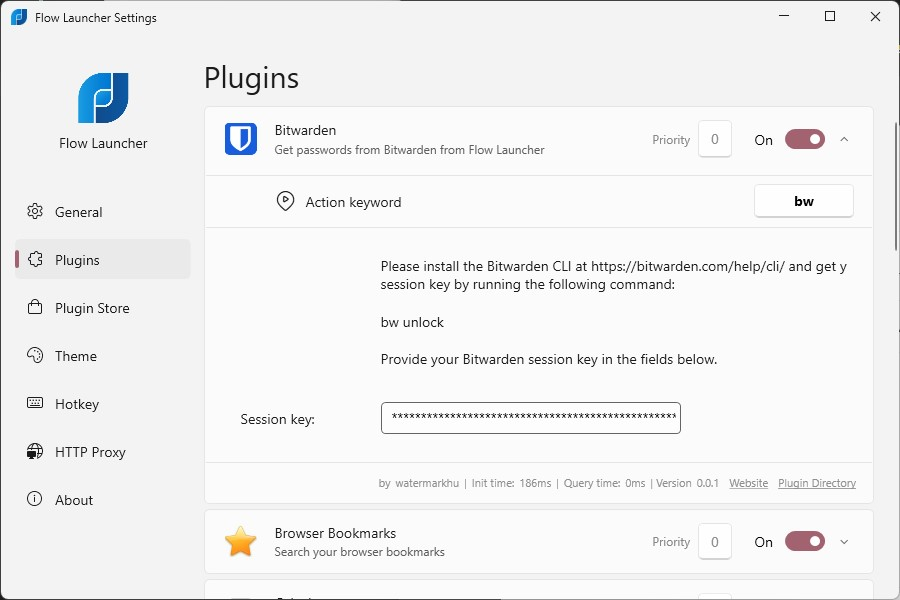
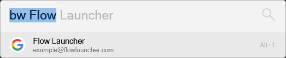
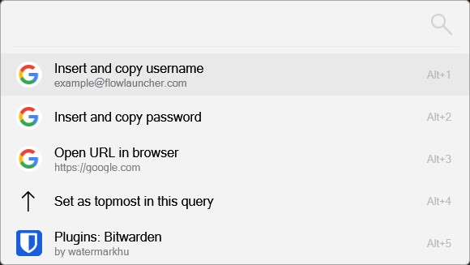
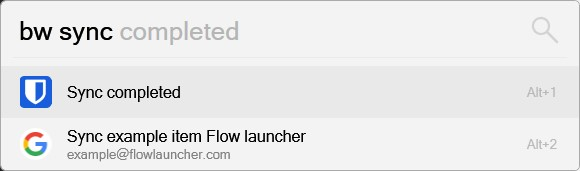

# FlowLauncherBitwarden
Get passwords from Bitwarden from Flow Launcher


## Installation:

Install the [Bitwarden CLI](https://bitwarden.com/help/cli/) for your platform from the official website.


### Flow Launcher:

Simply type `pm install bitwarden` to have the plugin installed

### Manual Installation:

Unzip [HA-Commander.zip](https://github.com/Garulf/HA-Commander/releases/latest) to your launchers plugin directory.

| Launcher      | Plugin Path                      |
|---------------|----------------------------------|
| Wox           | `%appdata%\Wox\Plugins`          |
| Flow Launcher | `%appdata%\FlowLauncher\Plugins` |


# Configuration

After installing the Bitwarden CLI, go to a terminal and login with your Bitwarden account with 

```bash
bw login
```
and follow the instructions provided. Then, get you Session key with 
```bash
bw unlock
```
and fill it into the plugin settings page.



# Usage

Search for passwords in Bitwarden with the default actionword `bw` and the name of the item. Press enter to copy and fill in the password directly.



In the context menu more actions are available, such as copy and inserting the username or topt, and opening any existing website stored for the item. 



To sync the vault, simply run the command `bw sync`, any password items found with the query will appear below. 


